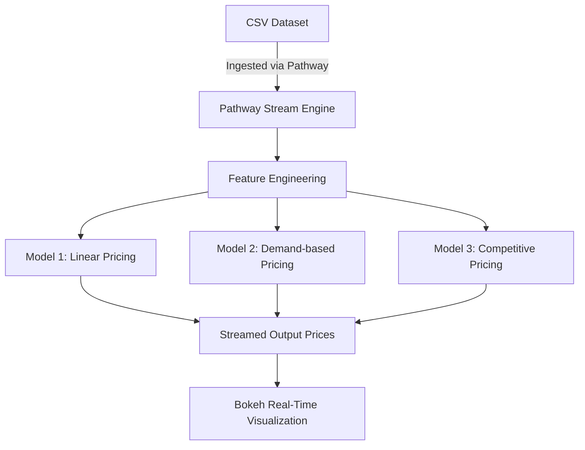

Hey! This repo documents my journey creating a Dynamic Pricing system for Urban Parking Lots, as part of the final capstone project for the Summer Analytics program hosted by CA-IITG.

---

### Overview
The main objective was to build a system that continuously updates parking prices in response to various factors, improving revenue.
This project simulates a **dynamic pricing system** for 14 urban parking lots using data-driven models built from scratch.
The pricing adapts in real time based on factors like occupancy, queue length, traffic, vehicle type, competition, etc.

---

### Core ideas/tools involved

- [x] Core programming language - **Python & Jupyter Notebooks**
- [x] External libraries - **Numpy, Pandas**
- [x] Interactive data visualization - **Bokeh**
- [x] Distance calculation betweek parking lots - **Geopy**
- [ ] Real-time data streaming - **Pathway**

---

### Architecture Diagram



---

### Given data

dataset.csv contains 18638 rows of parking lot data, spanning 73 days (18 timepoints per day).

Default features include - [Occupancy, QueueLength, Traffic, VehicleType, Latitute/Longitude, IsSpecialDay]

Data is processed through three modular pricing engines with increasing sophistication.

#### Model 1: *Linear pricing*

```
Priceₜ₊₁ = Priceₜ + α × (Occupancy / Capacity)
```

#### Model 2: *Demand-based pricing*

A custom cost function is created using the features mentioned above.
```
Price = Base × (1 + λ × NormalizedDemand)
```

#### Model 3: *Competitive pricing*

Computed geographic distance between competing parking lots using the geopy library.

The model checks competitor prices and adjusts accordingly.

---

### Visualization
* Bokeh dashboards show price evolution in real time

---

#### Final pricing graphs
Plots for only the first 3 parking lots are shown. For the rest pls refer to the .ipynb file.


---

---

---


_Note: I couldn't get the Pathway real-time data ingestion to work properly for the life of me, will probably come back to it in the near future once I get a bit more experience :)_

The final .ipynb file and dataset.csv are attached in the repo, kindly do check them out.

oh yeah and if for any reason you want to get in touch:
* <rayyanshaik175@gmail.com>
* [LinkedIn](https://www.linkedin.com/in/rayyan-shaik-67a017341/)
